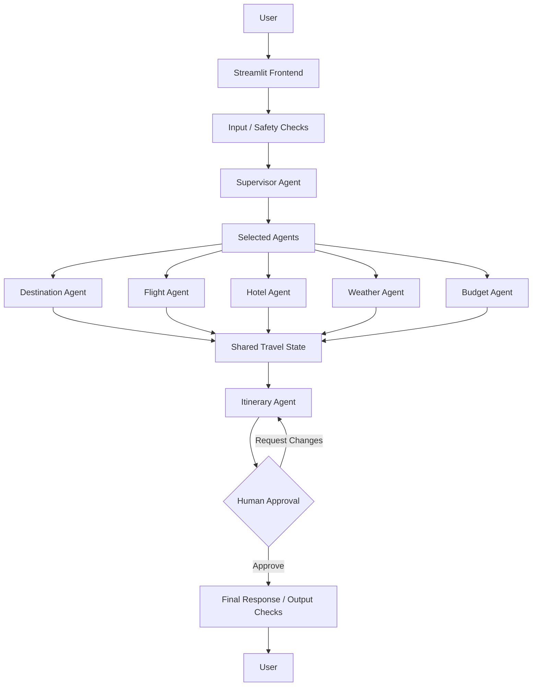

# ✈️ Multi-Agent AI Travel Planner

An AI-powered **multi-agent travel planning system** built with **LangGraph, LangChain, Groq, MCP integrations, external APIs, and Streamlit**.

The system takes a natural-language travel request and coordinates specialized agents for destination analysis, flight information, hotel research, weather information, budget estimation, and itinerary generation.

The workflow also supports **guardrails, human-in-the-loop approval, itinerary revision, and optional PostgreSQL checkpointing**.

---

## 🚀 Features

- 🤖 Multi-agent travel planning
- 🧠 Supervisor-based agent orchestration
- 🔄 Stateful workflow using LangGraph
- 🌍 Destination analysis
- ✈️ Flight information retrieval
- 🏨 Hotel/accommodation research
- 🌦️ Weather information
- 💰 Budget estimation and feasibility analysis
- 🗺️ Day-by-day itinerary generation
- 👤 Human-in-the-loop itinerary approval
- 🔁 Itinerary revision based on human feedback
- 🛡️ Input and output guardrail mechanisms
- 🔌 Model Context Protocol (MCP) integration
- 🌐 External API integrations
- 🔄 Fallback mechanisms for supported external services
- 💾 Optional PostgreSQL checkpointing
- 🧠 In-memory checkpointing for local development
- 🎨 Interactive Streamlit interface
- 🔐 Environment-variable based API key management

---

## 🏗️ System Architecture

The application uses a **supervisor-based multi-agent architecture**.

The supervisor analyzes the user's travel request and determines which specialized agents are required.

The selected agents are then executed through a controlled LangGraph workflow.

## High-Level Architecture



> The actual LangGraph workflow executes selected agents in a controlled sequence rather than requiring every agent to run for every request.

---

## 🔄 LangGraph Workflow

The workflow is implemented using **LangGraph `StateGraph`**.

The project maintains a fixed agent ordering and dynamically skips agents that are not selected by the supervisor.

```text
START
  │
  ▼
Supervisor Agent
  │
  ▼
Selected Agents
  │
  ├──► Destination Agent
  │
  ├──► Flight Agent
  │
  ├──► Hotel Agent
  │
  ├──► Weather Agent
  │
  └──► Budget Agent
          │
          ▼
    Itinerary Agent
          │
          ▼
    Human Approval
       │       │
       │       └──────── Request Changes
       │                      │
       │                      ▼
       │               Itinerary Agent
       │
       └──────── Approve
                    │
                    ▼
             Final Response
                    │
                    ▼
                   END
```

The supervisor determines the relevant agents, while the graph controls the order in which they execute.

---

## 🤖 Specialized Agents

### 🧠 1. Supervisor Agent

The supervisor acts as the controller of the travel-planning workflow.

It analyzes the user's request and determines information such as:

- Destination
- Trip duration
- Number of travelers
- Budget
- Travel constraints
- Required travel information
- Relevant specialized agents

The supervisor then routes the workflow to the selected agents.

### 🌍 2. Destination Agent

The destination agent handles destination-related information.

Responsibilities include:

- Destination identification
- Location information
- Country information
- Destination context
- Supporting location data

### ✈️ 3. Flight Agent

The flight agent gathers available flight-related information.

It can use configured flight/API integrations and fallback mechanisms to provide useful flight information for the travel plan.

### 🏨 4. Hotel Agent

The hotel agent researches accommodation information based on the travel request.

It considers factors such as:

- Destination
- Location
- Trip duration
- Number of travelers
- Budget
- Accommodation preferences

### 🌦️ 5. Weather Agent

The weather agent retrieves weather-related information for the destination.

It can use configured weather services and fallback mechanisms when supported services are unavailable.

### 💰 6. Budget Agent

The budget agent estimates the approximate cost of the trip.

It considers categories such as:

- Flights
- Accommodation
- Food
- Local transportation
- Activities
- Miscellaneous expenses

It also compares the estimated cost with the user's requested budget.

The system can identify situations where a requested budget is:

- Comfortable
- Tight
- Possible only with budget-oriented choices
- Not realistic for the requested trip

### 🗺️ 7. Itinerary Agent

The itinerary agent combines information produced by the other agents and generates a structured travel itinerary.

Example:

```text
Day 1
 ├── Arrival
 ├── Hotel check-in
 └── Local sightseeing

Day 2
 ├── Major attractions
 ├── Lunch
 └── Evening activities

Day 3
 ├── Cultural attractions
 ├── Local food
 └── Leisure

Day 4
 ├── Shopping
 ├── Checkout
 └── Departure
```

---

## 👤 Human-in-the-Loop

The system includes a **human approval stage** before the itinerary is finalized.

The generated itinerary can be reviewed by the user.

```text
Generated Itinerary
        │
        ▼
Human Review
        │
   ┌────┴────────────┐
   │                 │
Approve          Request Changes
   │                 │
   │                 ▼
   │          Itinerary Agent
   │                 │
   └─────────────────┘
            │
            ▼
       Final Response
```

If the user requests changes, the workflow can route back to the itinerary agent and generate a revised plan.

---

## 🛡️ Guardrails

The project includes guardrail-related mechanisms for improving the reliability and safety of the application.

### Input Guardrails

The user's travel request is evaluated before the main planning workflow proceeds.

```text
User Request
     │
     ▼
Input Checks
     │
 ┌───┴────┐
 │        │
Allow    Block
 │
 ▼
Supervisor
```

The application maintains guardrail information in the shared travel state.

### Output Guardrails

The application also maintains output-validation information before the final response is returned.

This provides a foundation for checking generated responses and improving reliability.

---

## 🔌 Model Context Protocol (MCP)

The project uses the **Model Context Protocol (MCP)** architecture for tool integration.

MCP provides a standardized approach for connecting AI applications with external tools and services.

The project uses:

- `langchain-mcp-adapters`
- MCP-compatible tools
- External APIs
- HTTP-based fallback mechanisms

The application can use configured MCP services while retaining fallback functionality for supported operations.

---

## 🌐 External Services and Data Sources

Depending on configuration and availability, the application can work with services such as:

- AviationStack
- OpenWeather
- Tavily
- OpenStreetMap / Nominatim
- Geocoding services
- Airport information sources
- Currency/exchange-rate services

The application uses environment variables for API credentials.

API keys are not hard-coded into the source code.

---

## 🧠 LLM

The application uses **Groq** as the LLM provider.

The default model configuration is:

```text
openai/gpt-oss-120b
```

The model configuration can be changed through environment variables.

Example:

```env
GROQ_MODEL=openai/gpt-oss-120b
GROQ_REASONING_EFFORT=low
```

---

## 🧩 Technology Stack

### AI / LLM

- Python
- LangChain
- LangGraph
- Groq
- Large Language Models

### Agentic AI

- Multi-Agent Systems
- Supervisor-based orchestration
- Tool Calling
- Model Context Protocol (MCP)
- Human-in-the-Loop
- Guardrails
- Stateful workflows

### APIs / Integration

- HTTPX
- Requests
- REST APIs
- MCP adapters
- External travel and location services

### Database / Persistence

- PostgreSQL
- Psycopg
- `langgraph-checkpoint-postgres`
- `MemorySaver` fallback

### Frontend

- Streamlit

### Development

- Git
- GitHub
- Python Virtual Environment
- Environment Variables

---

## 📁 Project Structure

```text
MULTIAGENT_AI_SYSTEM/
│
├── agents.py
├── config.py
├── frontend.py
├── graph.py
├── mcp_client.py
├── state.py
│
├── requirements.txt
├── .env.example
├── .gitignore
└── README.md
```

## Main Files

| File | Responsibility |
|------|----------------|
| `agents.py` | Agent implementations and travel-planning logic |
| `config.py` | Environment configuration and LLM setup |
| `frontend.py` | Streamlit user interface |
| `graph.py` | LangGraph workflow, routing, and checkpointing |
| `mcp_client.py` | MCP integrations and external API utilities |
| `state.py` | Shared LangGraph travel state |
| `requirements.txt` | Python dependencies |
| `.env.example` | Environment variable template |
| `.gitignore` | Files excluded from Git |

---

## 🔄 Shared State

The agents communicate through a shared `TravelState`.

The state can contain information such as:

```text
user_query
trip_constraints
selected_agents
supervisor_reasoning

destination_info
flight_results
hotel_results
weather_results
budget_results

itinerary

human_feedback
approved
revision_count

final_response

guardrail information
data sources
LLM call information
```

This shared state allows the specialized agents to contribute information to the same travel-planning workflow.

---

## 💾 Checkpointing

The application supports PostgreSQL-based checkpointing as well as an in-memory fallback.

### PostgreSQL

When `DATABASE_URL` is configured, the application attempts to initialize a PostgreSQL checkpointer.

This allows LangGraph workflow state to be persisted.

### In-Memory Fallback

If PostgreSQL is not configured or cannot be initialized, the application falls back to:

```text
MemorySaver
```

This allows the application to run locally without requiring a PostgreSQL database.

---

## ⚙️ Installation

### 1. Clone the Repository

```bash
git clone https://github.com/surajkeshri-1912/MULTIAGENT_AI_SYSTEM.git
```

```bash
cd MULTIAGENT_AI_SYSTEM
```

### 2. Create a Virtual Environment

#### Windows

```powershell
python -m venv langgraph_env3
```

Activate it:

```powershell
.\langgraph_env3\Scripts\Activate.ps1
```

#### Linux / macOS

```bash
python -m venv langgraph_env3
```

```bash
source langgraph_env3/bin/activate
```

### 3. Install Dependencies

```bash
pip install -r requirements.txt
```

---

## 🔐 Environment Variables

Create a `.env` file in the project root.

Use `.env.example` as the template.

```env
GROQ_API_KEY=your_groq_api_key

TAVILY_API_KEY=your_tavily_api_key

AVIATION_STACK_API_KEY=your_aviationstack_api_key

OPENWEATHER_API_KEY=your_openweather_api_key

DATABASE_URL=your_postgresql_connection_string

GROQ_MODEL=openai/gpt-oss-120b

GROQ_REASONING_EFFORT=low
```

### ⚠️ Security

**Never commit `.env` or API keys to GitHub.**

The project includes `.env` in `.gitignore`.

For deployment platforms such as Streamlit Community Cloud, API keys should be configured using the platform's secret-management system.

---

## ▶️ Run Locally

Start the Streamlit application:

```bash
streamlit run frontend.py
```

The terminal will provide a local Streamlit URL.

Open that URL in your browser to use the application.

---

## 🖥️ Example User Request

Example:

```text
Plan a 5-day trip from Delhi to Thailand for 2 people
with a moderate budget.
```

The system processes the request through the agent workflow:

```text
User Request
     ↓
Input / Safety Checks
     ↓
Supervisor Agent
     ↓
Selected Specialized Agents
     ↓
Destination
     ↓
Flight
     ↓
Hotel
     ↓
Weather
     ↓
Budget
     ↓
Itinerary
     ↓
Human Approval
     │
     ├── Request Changes ──► Itinerary
     │
     └── Approve
            ↓
      Final Response
```

The exact agents executed depend on the user's request and the supervisor's selection.

---

## 🎯 Why This Project?

This project demonstrates practical implementation of concepts used in modern AI engineering:

- LLM application development
- Agentic AI
- Multi-agent orchestration
- Graph-based AI workflows
- Stateful agent systems
- Tool integration
- MCP
- External API integration
- Human-in-the-loop systems
- Guardrails
- Error handling
- Fallback mechanisms
- Persistent workflow state
- Interactive AI applications

Instead of relying on a single LLM call, the application separates travel-planning responsibilities across specialized agents and coordinates them through a graph-based workflow.

---

## 🔮 Future Improvements

Potential future improvements include:

- Real-time flight booking integrations
- Real-time hotel booking integrations
- User preference memory
- Retrieval-Augmented Generation (RAG)
- Vector database integration
- More advanced itinerary optimization
- Agent evaluation framework
- Automated agent testing
- Observability and tracing
- Cost and latency monitoring
- More advanced AI safety checks
- Docker-based deployment
- Production PostgreSQL infrastructure

---

## 📚 Key Concepts Demonstrated

```text
LLM
 ↓
Supervisor Agent
 ↓
Specialized Agents
 ↓
Tool / MCP Integration
 ↓
Shared State
 ↓
LangGraph Workflow
 ↓
Human-in-the-Loop
 ↓
Guardrails
 ↓
Final AI Response
```

---

## 👨‍💻 Author

### Suraj Keshri

**MCA — Banaras Hindu University**

### Areas of Interest

- Artificial Intelligence
- Machine Learning
- Large Language Models
- Agentic AI
- AI Systems
- Computer Networks
- Reliable AI
- AI Safety

---

## ⭐ If you find this project useful

Feel free to ⭐ the repository and explore the implementation.
